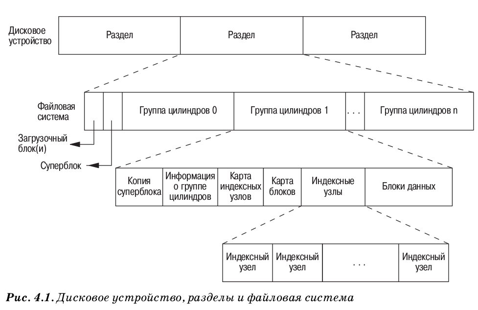
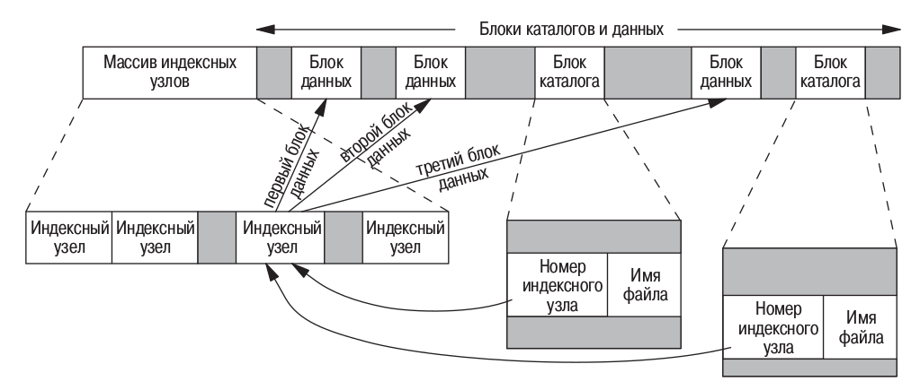

# Задание

Написать программу, выводящую на экран дерево каталогов.

Приведенная версия функции **myftw** действует только в текущем каталоге. Необходимо изменить функцию таким образом, чтобы всякий раз, когда встречается каталог функция **myftw** вызывала функцию **chdir()** для перехода в этот каталог. Это делается для того, чтобы передавать функции **lstat()** только короткое имя файла. После обработки всех файлов в каталоге необходимо вызвать **chdir(“..”)**.

# Теория

## Функции stat, fstat, lstat
```c
#include <sys/stat.h>
int stat(const char *restrict pathname, struct stat *restrict buf);
int fstat(int filedes, struct stat *buf);
int lstat(const char *restrict pathname, struct stat restrict buf);
```
- возвращают 0, если успех, иначе - 0;
- **stat** - возвращает структуру с информацией о файле;
- **fstat** - возвращает информацию об открытом файле, который определяется дескриптором **fields**;
- **lstat** - аналогична **stat**, но при передаче сиволической ссылки возвращает инфу о ссылке.

## Структура stat
```c
struct stat {
    mode_t st_mode; /* тип файла и режим (права доступа) */
    ino_t st_ino;
    /* номер индексного узла */
    dev_t st_dev;
    /* номер устройства (файловой системы) */
    dev_t st_rdev;
    /* номер устройства для специальных файлов */
    nlink_t st_nlink; /* количество ссылок */
    uid_t st_uid;
    /* идентификатор пользователя владельца */
    gid_t st_gid;
    /* идентификатор группы владельца */
    off_t st_size;
    /* размер в байтах, для обычных файлов */
    time_t st_atime; /* время последнего обращения к файлу */
    time_t st_mtime; /* время последнего изменения файла */
    time_t st_ctime; /* время последнего изменения флагов состояния файла */
    blksize_t st_blksize; /* оптимальный размер блока ввода-вывода */
    blkcnt_t st_blocks; /* количество занятых дисковых блоков */
};
```

## Типы файлов
| Макроопределение | Тип файла |
|----------|----------|
|S_ISREG()|Обычный файл|
|S_ISDIR()|Каталог|
|S_ISCHR()|Специальный файл символьного устройства|
|S_ISBLK()|Специальный файл блочного устройства|
|S_ISFIFO()|Канал (именованный или неименованный)|
|S_ISLNK()|Символическая ссылка|
|S_ISSOCK|Сокет|

# Файловые системы
**Индексные узлы** – это записи фиксированной длины, которые содержат
большую часть сведений о файлах.


Индексный узел содержит полную информацию о файле: тип файла, би ты прав доступа, размер файла, указатели на блоки данных файла и тому подобное. Большая часть информации для структуры stat берется из индексного узла. Только два элемента, которые могут представлять для нас
интерес, берутся из записи в файле каталога: имя файла и номер индексного узла.


Поскольку номер индексного узла в каталожной записи ссылается на индексный узел, находящийся в той же самой файловой системе, нельзя создать запись, которая указывала бы на индексный узел в другой файловой
системе.

## Символические ссылки
Символическая ссылка представляет собой косвенную ссылку на файл, в отличие от жесткой ссылки, которая является прямым указателем на индексный узел файла. Символические ссылки были придуманы с целью обойти
ограничения, присущие жестким ссылкам.

## Чтение каталогов
```c
struct dirent {
    ino_t d_ino;
    /* номер индексного узла */
    char d_name[NAME_MAX + 1]; /* строка имени файла, завершающаяся */
    /* нулевым символом */
}
```
- DIR является внутренней структурой; - Функция opendir выполняет
первичную инициализацию таким образом, чтобы последующий вызов readdir прочитал первую запись из файла каталога. Порядок следования записей в каталоге, как правило, зависит от реализации и обычно не совпадает с алфавитным.

[Полезно посмотреть](https://youtu.be/dWjo7HzRh1E?si=1ts7LfazbzTIR5p3)